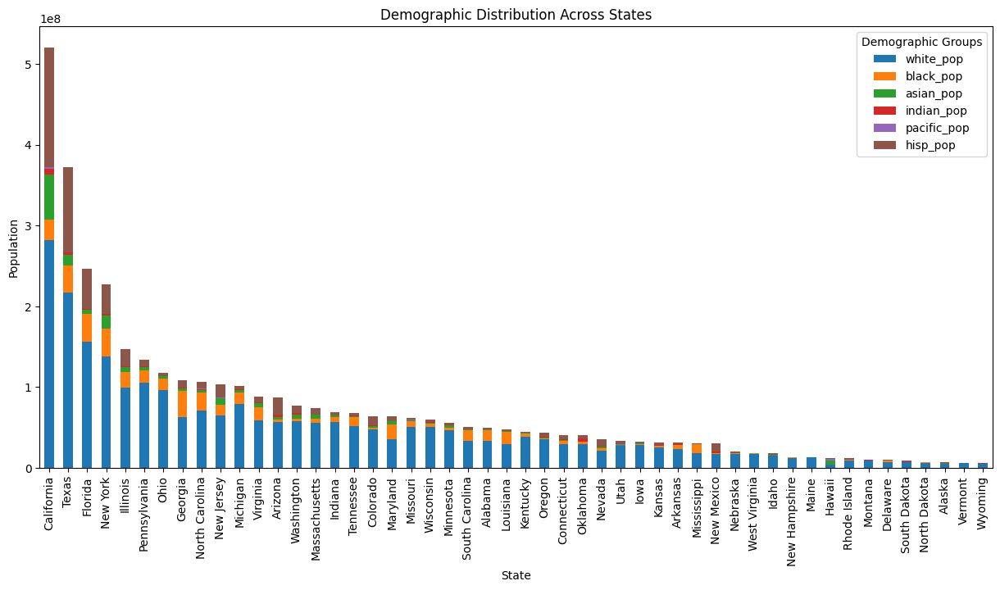

# county-level-population-by-race-ethnicity
---
## Installation
Assumption is that python is installed and working without issue.
### JupyterLab
For this project, I have used [JupyerLab](https://jupyter.org/install) to share the code easier.

Install JupyterLab with pip:

```pip install jupyterlab```

Once installed, launch JupyterLab with:

```jupyter lab```

### Libraries
Use the below pip install to install the libraries

```pip install pandas matplotlib plotly scikit-learn seaborn```

---

## Libraries Used

pandas (pd):
Data manipulation and analysis library for Python.
Provides data structures like DataFrames and Series for handling and analyzing structured data.

matplotlib.pyplot (plt):
Library for creating static, animated, and interactive visualizations in Python.
pyplot is a module in matplotlib that provides a MATLAB-like interface for creating plots and charts.

seaborn (sns):
Statistical data visualization library based on matplotlib.
Provides a high-level interface for drawing attractive and informative statistical graphics.

sklearn:
Machine learning library for Python.
Provides simple and efficient tools for data mining and data analysis, including both supervised and unsupervised learning algorithms.

---

## Graphs Generated

Demographic Distribution Across States



Demographic Distribution Across Top Counties


